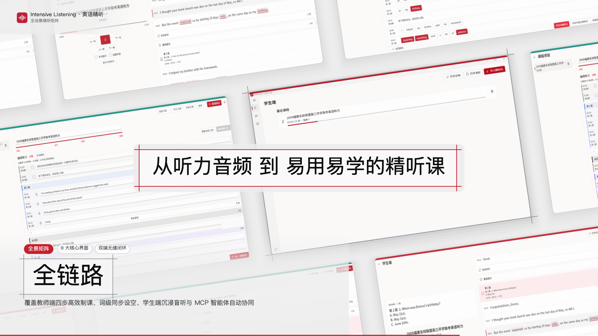
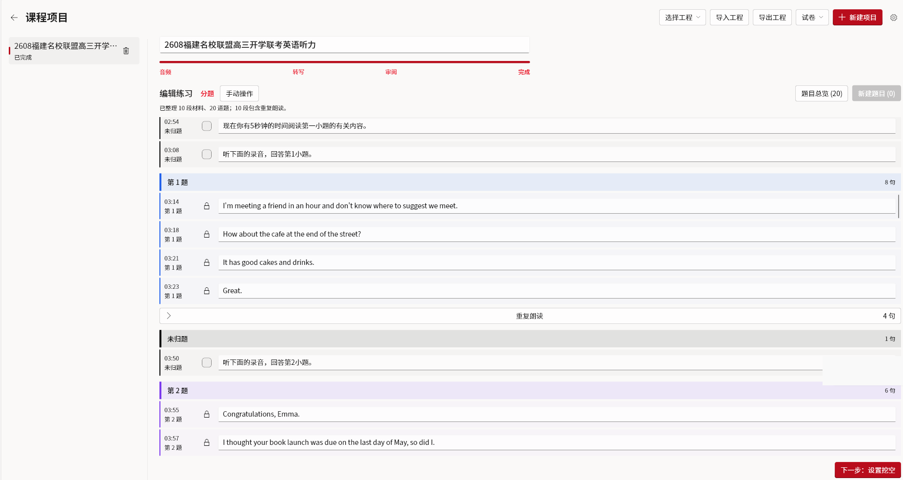
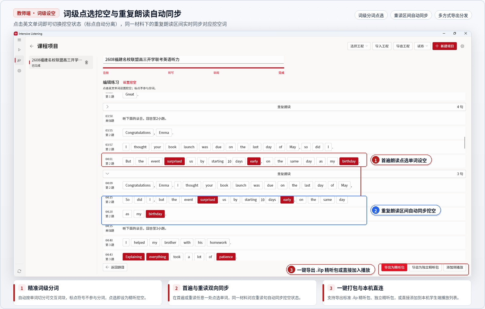
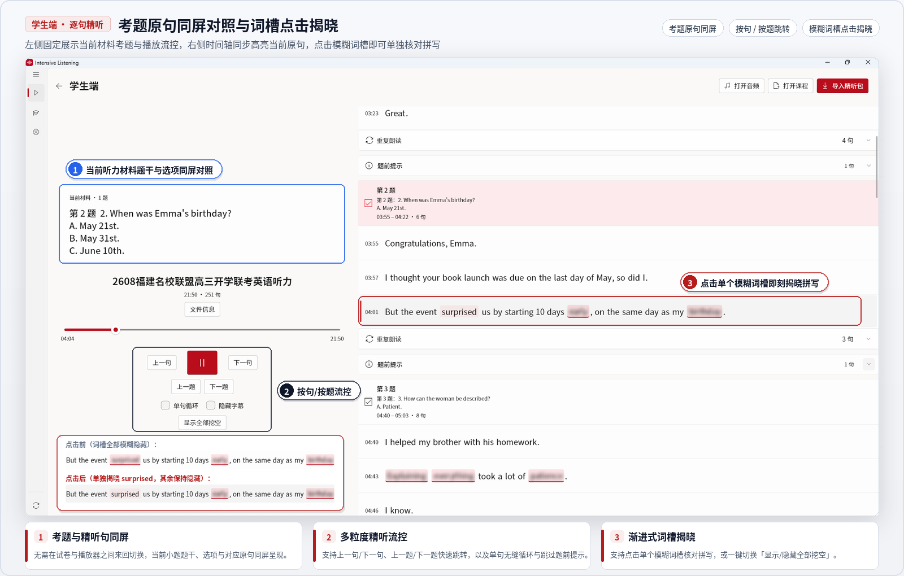
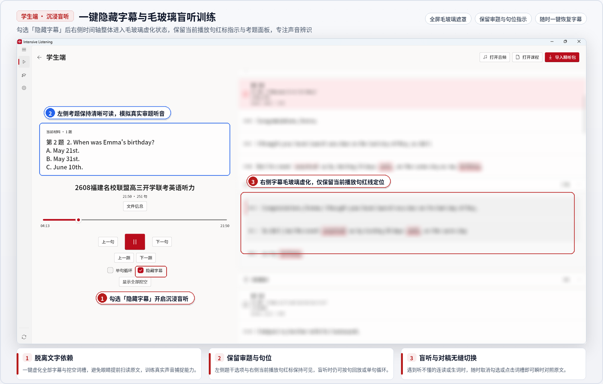
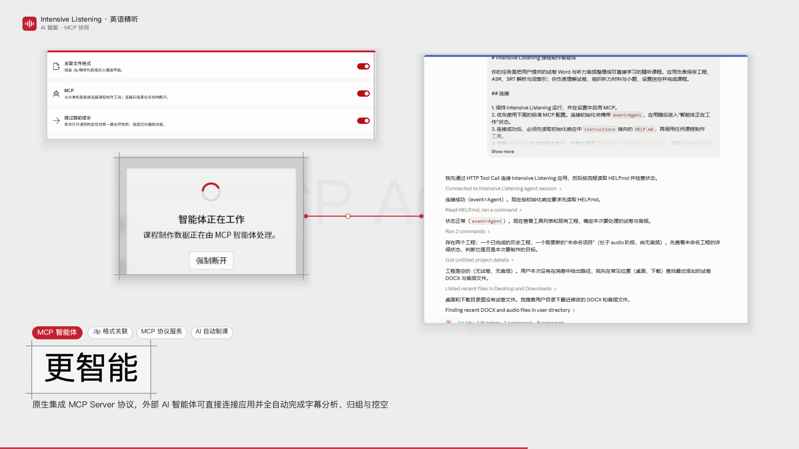

<div align="center">
  
  <h1>Intensive Listening</h1>
  <p>面向英语听力教学的材料制作与逐句训练工具</p>
  <p>
    
    
    
    
    <a href="LICENSE"></a>
  </p>
</div>

<p align="center">
  
</p>

## 项目简介

Intensive Listening 是一款面向英语听力教学的 Windows 桌面应用，将听力材料整理、题目编排、智能体协同制课与逐句盲听训练整合为连贯的课程制作与学习流程。

教师可以通过四步向导（「音频 → 转写 → 审阅 → 完成」）或内置 MCP 智能体工作流，从听力音频、试卷与参考原文快速建立课程项目，完成句子校对、材料与小题划分、选项与答案配置、题前提示与重复朗读绑定以及词级同步挖空；学生可以在原句与考题同屏的时间轴中按句或按题精听，结合单句循环、隐藏字幕盲听与点击揭晓挖空完成沉浸训练。

> [!IMPORTANT]
> 项目目前处于早期开发阶段，交互、接口和课程文件格式仍会持续演进。现阶段适合参与开发、功能试用与问题反馈。

## 当前能力

### 课程制作（教师端）

- **四步向导制课**：按「音频 → 转写 → 审阅 → 完成」管理课程工程，支持本地草稿与智能体修改版本冲突处理
- **转写与时间轴校对**：导入音频或 SRT 字幕，支持 VAD 语音切分与阿里云百炼（DashScope）云端 ASR 转写，在时间轴中逐句校对与合并拆分
- **材料与小题编排**：按听力材料（对话/独白）树状组织小题，编辑题号、题干、选项（`A / B / C...`）与正确答案
- **题前提示与重复朗读**：绑定题前播报提示（`题前提示`）与二遍重读区间（`重复朗读`），在时间轴上直观折叠展示
- **词级点选与重读同步设空**：按词点选设置挖空，自动同步同一材料下重复朗读区间的对应挖空词
- **一键打包与分发**：支持导出为 `.ilp` 精听包，或直接添加到本机学生端播放列表

<p align="center">
  
</p>

<p align="center">
  
</p>

### 精听练习（学生端）

- **即开即练与进度记忆**：支持直接打开音频、课程或双击关联的 `.ilp` 精听包，自动记忆并恢复上次练习进度，支持开启「跳过题前提示」直接定位至首题
- **原句与考题同屏**：左侧展示当前材料题干、选项与答案显隐切换，右侧时间轴同步高亮当前播放原句，并可展开或折叠题前提示与重复朗读区间
- **多粒度流控定位**：支持上一句 / 下一句、上一题 / 下一题、重复本句与单句无缝循环播放
- **沉浸盲听与挖空揭晓**：支持一键勾选「隐藏字幕」进入全屏毛玻璃盲听模式，支持「显示/隐藏全部挖空」或在模糊词槽上点击即刻揭晓拼写

<p align="center">
  
</p>

<p align="center">
  
</p>

### MCP 智能体协同制课

- **一键引导与安全审批**：在设置中启用 MCP 后，复制 MCP 配置到客户端，再复制一键操作提示发送给 AI（引导读取 `MCP.md` 与 `SKILL.md`）；连接时弹出 60 秒倒计时审批（「是 / 否 / 关闭 MCP」），授权后进入 `event=Agent` 接管状态
- **多源资料接入**：支持绑定本地音频并触发后台 ASR（`import_project_media`、`start_project_asr`），同时导入从试卷/答案/原文 DOCX 或可提取文本 PDF 转换出的 UTF-8 文本（`import_project_text`、`read_project_text`）
- **全链路自动编排**：智能体可对照原文分页校对并回写 SRT（`read_project_srt`、`set_cue_text`、`import_project_srt`），原子提交材料、小题、选项、答案、题前提示与重复朗读区间（`auto_plan_questions`、`apply_question_plan`），并同步生成词级挖空与校验工程（`apply_cloze_plan`、`validate_course_project`）
- **会话释放与热刷新**：制作完成后调用 `end_agent_session`（或 `/v1/agent/disconnect`）退回 `event=User` 模式，应用自动刷新工程列表并回到制作首页

设置页提供日志目录、调试模式和日志清理；数据遥测与版本检查的后续设计见 [规划文档](TELEMETRY_UPDATE_PLAN.md)。

<p align="center">
  
</p>

## 课程制作与训练流程

### 1. 教师端 / MCP 智能体制课流程

```text
创建或复用工程 → 导入音频并启动 ASR / 导入试卷与参考原文 → 对照原文校对 SRT 时间轴
  → 划分材料与小题（题干 / 选项 / 答案 / 题前提示 / 重复朗读）
  → 词级点选设空（重复朗读区间自动同步） → 校验工程并导出 .ilp 精听包
```

### 2. MCP 智能体握手与执行时序

```text
开启设置中 MCP 开关 → 配置 MCP 客户端并把一键操作提示发给 AI → AI 读取 MCP.md 并调用 intensive_listening_status
  → 应用内确认 60s 接管弹窗（event=Agent） → AI 读取 SKILL.md 完成转写、校对、分题与挖空
  → 调用 validate_course_project 与 end_agent_session（event=User） → 自动刷新制作工程列表
```

### 3. 学生端精听练习流程

```text
双击或导入 .ilp 精听包 → 题干选项与精听原句同屏对照 → 单句循环 / 按题定位精听
  → 开启“隐藏字幕”沉浸盲听 → 点击模糊词槽核对拼写与查看答案
```

## 课程制作 API 配置（阿里云百炼）

课程制作中的自动语音转写（ASR）默认对接**阿里云百炼（Model Studio / DashScope）**语音识别服务；学生端日常打开 `.ilp` 精听包进行练习无需配置 API。

### 1. 获取 API Key

1. 前往 [阿里云百炼控制台](https://bailian.console.aliyun.com/) 登录并开通百炼大模型服务。
2. 进入「API-KEY 管理」页面，创建并复制 `sk-` 开头的 **API Key**。

### 2. 在应用内填入配置

打开应用左侧导航栏 **「设置」 → 「API 设置」**，应用已预置默认服务端点与模型名称，只需粘贴 `Key` 即可用于课程制作（也支持通过密码加密的 `.zip` 配置包一键导入/导出）：

| 配置项 | 默认值 / 说明 |
| --- | --- |
| **API Endpoint** | `https://dashscope.aliyuncs.com` |
| **Path** | `/api/v1/services/aigc/multimodal-generation/generation` |
| **Name** | `qwen-audio-3.0-asr-flash` |
| **Key** | 填入从阿里云百炼获取的 API Key（仅保存在本机） |
| **分段并发** | `1 ~ 10`（默认 `10`） |
| **单段超时（秒）** | 默认 `180` 秒 |

> [!TIP]
> **音频切片与并发策略**：应用内置 VAD 会在静音处自动切分长听力音频，单段最长 `120` 秒（确保单次请求低于 `10 MB`），并发与请求启动速率均限制在 `10 QPS` 以内。若已有现成 `.srt` 字幕文件，也可在制课向导中直接导入字幕跳过云端转写。

## 从源码运行

### 开发环境

- Windows 10 或 Windows 11 x64
- Flutter stable，并启用 Windows Desktop
- Visual Studio 2022，安装“使用 C++ 的桌面开发”工作负载
- FFmpeg 9.0.1 essentials x64

### 获取源码

```powershell
git clone https://github.com/luyii-code-1/Intensive_Listening.git
cd Intensive_Listening
flutter pub get
```

从 [GyanD/codexffmpeg 9.0.1](https://github.com/GyanD/codexffmpeg/releases/tag/9.0.1) 获取 Windows x64 essentials 构建，将 `ffmpeg.exe` 放入：

```text
windows/third_party/ffmpeg/ffmpeg.exe
```

依赖版本与校验值记录在 [windows/third_party/ffmpeg/README.md](windows/third_party/ffmpeg/README.md)。

### 运行与构建

```powershell
flutter run -d windows
```

```powershell
flutter analyze
flutter test
flutter build windows --release
```

### 自动构建

GitHub Actions 在 `main` 分支提交、面向 `main` 的 PR，以及 Release 发布时构建 Windows 安装包。每次成功构建的安装包可在对应工作流的 Artifacts 中下载；Release 构建完成后也会自动附加到该 Release。

## 技术组成

| 领域 | 实现 |
| --- | --- |
| 桌面界面 | Flutter、fluent_ui |
| 音频播放 | media_kit、Windows 原生播放器集成 |
| 音频处理 | FFmpeg、VAD 语音活动切分、可配置 ASR 转写 |
| 项目与课程 | 本地工程文件、ZIP 容器、`.ilp` 精听课程包（支持系统文件关联） |
| 智能体接口 | 标准 HTTP MCP Server、HTTP Tool Call、内置 `MCP.md` / `SKILL.md` 引导协议 |

## 源码结构

```text
assets/            字体、证书、许可文本与品牌资源
lib/
  asr/             ASR 服务配置与云端转写客户端
  audio/           音频处理与波形/播放控制辅助
  documents/       文档与材料文本管理
  ilp/             .ilp 课程包编解码、题目结构规划与词级挖空模型
  mcp/             MCP Server、HTTP Tool Call 接口与智能体 SKILL 引导定义
  projects/        教师端课程工程存储与版本管理
  settings/        应用设置、文件关联与 MCP 开关配置
  student/         学生端时间轴跟随、词槽交互与词典查询接口
  transcription/   VAD 语音切分与 SRT 字幕解析
  widgets/         桌面端通用通知栏与交互组件
test/              单元测试与组件测试
windows/           Windows Runner、文件关联与原生集成源码
```

## 参与项目

欢迎通过 [Issues](https://github.com/luyii-code-1/Intensive_Listening/issues) 提交问题、使用反馈和功能建议。有效的问题报告通常包括：

- 应用版本与 Windows 版本
- 可重复的操作步骤
- 预期行为与实际表现
- 必要的日志或界面截图

提交代码前，请运行 `flutter analyze` 和 `flutter test`，并说明变更覆盖的使用场景。

## 许可证

Copyright © 2026 Luyii。

本项目源代码采用 [GNU General Public License v3.0](LICENSE)（GPL-3.0-only）许可。字体、FFmpeg 与其他第三方组件适用各自的许可证。
