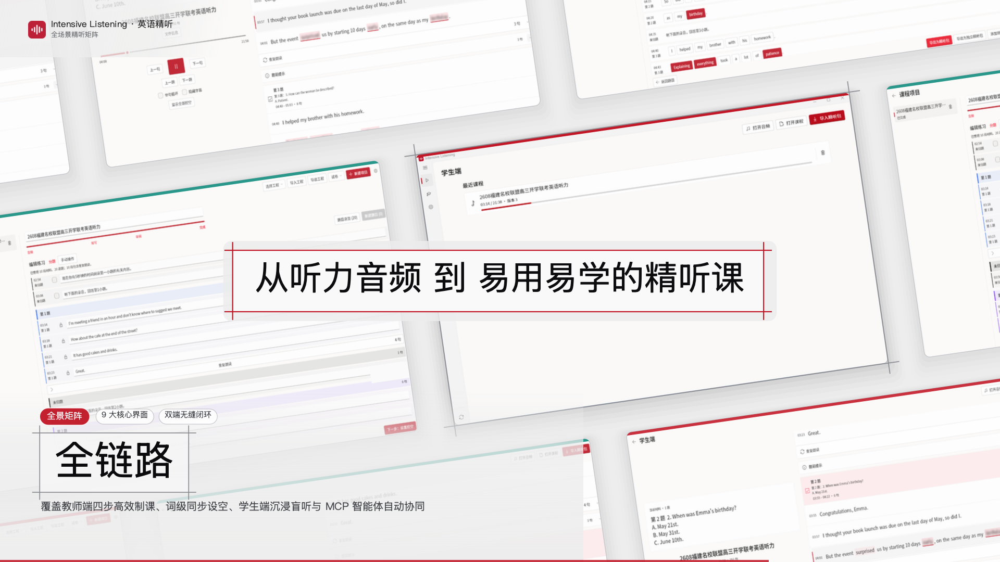
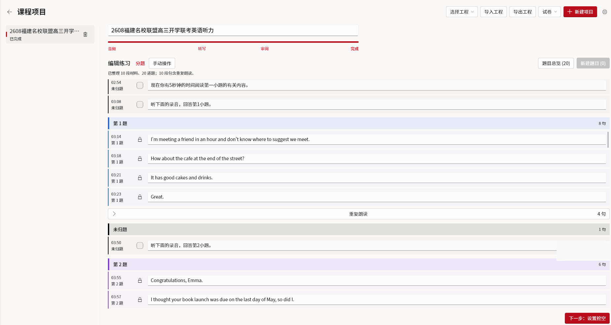
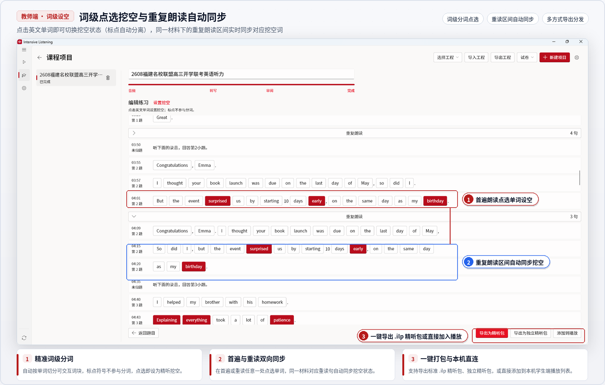
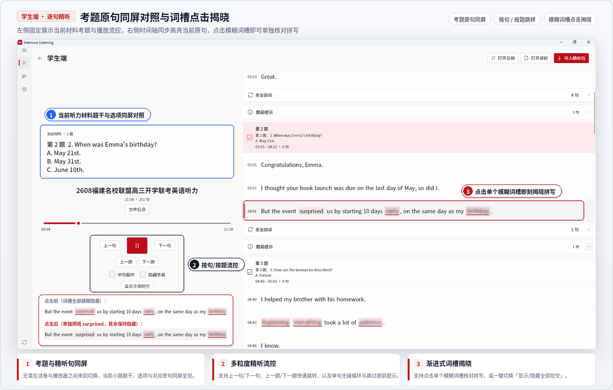
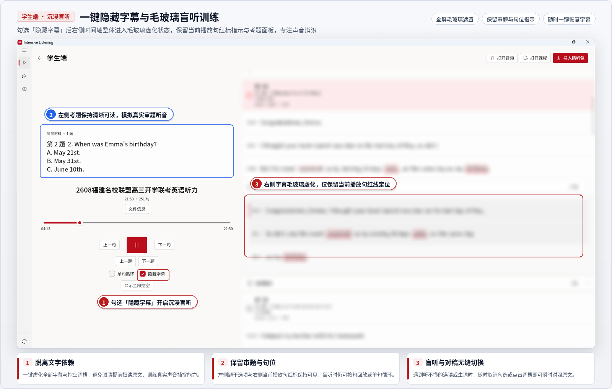
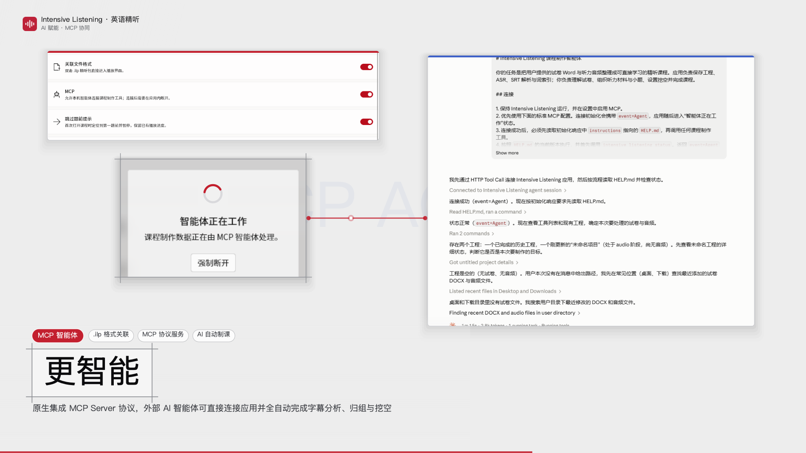

<div align="center">
  
  <h1>Intensive Listening 2 Resonance</h1>
  <p>面向英语听力教学的材料制作与逐句训练工具</p>
  <p>
    
    
    
    
    <a href="LICENSE"></a>
  </p>
</div>

<p align="center">
  
</p>

## 项目简介

Intensive Listening 是一款面向英语听力教学的 Windows 桌面应用，将听力材料整理、题目编排、智能体协同制课与逐句盲听训练整合为连贯的课程制作与学习流程。

教师可以通过四步向导（「音频 → 转写 → 审阅 → 完成」）或内置 MCP 智能体工作流，从听力音频、试卷与参考原文快速建立课程项目，完成句子校对、材料与小题划分、选项与答案配置、题前提示与重复朗读绑定以及词级同步挖空；学生可以在原句与考题同屏的时间轴中按句或按题精听，结合单句循环、隐藏字幕盲听与点击揭晓挖空完成沉浸训练。

> [!IMPORTANT]
> 项目目前处于早期开发阶段，交互、接口和课程文件格式仍会持续演进。现阶段适合参与开发、功能试用与问题反馈。

## 当前能力

### 课程制作（教师端）

- **制作方式选择**：新建项目时选择人工制作或智能体制作；人工制作进入「音频 → 转写 → 审阅 → 完成」流程，可设置标题、选择音频和导入 SRT
- **转写与时间轴校对**：导入音频或 SRT 字幕，支持 VAD 语音切分与阿里云百炼（DashScope）云端 ASR 转写，在时间轴中逐句校对与合并拆分
- **材料与小题编排**：按听力材料（对话/独白）树状组织小题，编辑题号、题干、选项（`A / B / C...`）与正确答案
- **题前提示与重复朗读**：绑定题前播报提示（`题前提示`）与二遍重读区间（`重复朗读`），在时间轴上直观折叠展示
- **词级点选与重读同步设空**：按词点选设置挖空，自动同步同一材料下重复朗读区间的对应挖空词
- **保存与分发**：审阅中保留自动保存草稿；点击「保存」后显示「导出为精听包」与「添加到播放」，再次编辑后需重新保存。支持导出 `.ilp` 或添加到本机播放列表

<p align="center">
  
</p>

<p align="center">
  
</p>

### 精听练习（学生端）

- **即开即练与进度记忆**：支持直接打开音频、课程或双击关联的 `.ilp` 精听包，自动记忆并恢复上次练习进度，支持开启「跳过题前提示」直接定位至首题
- **原句与考题同屏**：左侧展示当前材料题干、选项与答案显隐切换，右侧时间轴同步高亮当前播放原句，并可展开或折叠题前提示与重复朗读区间
- **多粒度流控定位**：支持上一句 / 下一句、上一题 / 下一题、重复本句与单句无缝循环播放
- **沉浸盲听与挖空揭晓**：支持一键勾选「隐藏字幕」进入全屏毛玻璃盲听模式，支持「显示/隐藏全部挖空」或在模糊词槽上点击即刻揭晓拼写

<p align="center">
  
</p>

<p align="center">
  
</p>

### MCP 智能体协同制课

- **素材准备与交接**：智能体制作页可设置标题、选择一个必选音频和多份可选材料，推荐 DOCX 或文字版 PDF。打开本机智能体（例如 WorkBuddy），复制含文件路径与制作任务的提示词到对话框并发送；页面显示推荐模型 DeepSeek-v4.1 Flash。
- **接管审批与授权管理**：在制作页或设置中启用 MCP，首次使用可复制 MCP 配置到客户端。设置的 MCP 折叠区提供注册与授权状态、撤销授权和删除注册。`MCP.md` 引导先检查 `/test`，再注册自报名称并获得专属 UUID 与 MCP URL；首次调用 `change_event` 请求接管时弹出 60 秒审批（「是 / 否 / 关闭 MCP」），超时按拒绝处理，同一 UUID 获批后可复用授权；撤销后重新审批，删除注册后需重新注册。接管期间主窗口显示当前智能体的自报名称
- **制作进度**：接管界面显示制作 Skill 的 11 步和详细操作状态。智能体通过 `report_authoring_step` 上报进行中、已完成、跳过或失败；完成及跳过步骤计入进度，转写与资料提取可并行。
- **多源资料接入**：支持绑定本地音频并触发后台 ASR（`import_project_media`、`start_project_asr`），同时导入从试卷/答案/原文 DOCX 或可提取文本 PDF 转换出的 UTF-8 文本（`import_project_text`、`read_project_text`）
- **全链路自动编排**：智能体可对照原文分页校对并回写 SRT（`read_project_srt`、`set_cue_text`、`import_project_srt`），原子提交材料、小题、选项、答案、题前提示与重复朗读区间（`auto_plan_questions`、`apply_question_plan`），并同步生成词级挖空与校验工程（`apply_cloze_plan`、`validate_course_project`）
- **会话释放与热刷新**：制作完成后调用 `change_event(event: "User")` 退回用户模式，应用自动刷新工程列表并回到制作首页

设置页通过分类导航组织外观与字体、播放、制作与智能体、数据与维护、隐私与关于。应用字体可从本机字体列表选择，支持字重、可编辑预览和恢复默认，并即时应用；Windows 安装后在主窗口内铺满展示首次设置，引导设置文件关联、MCP、转写 API 与匿名数据分析。

<p align="center">
  
</p>

## 课程制作与训练流程

### 1. 教师端 / MCP 智能体制课流程

```text
创建或复用工程 → 导入音频并启动 ASR / 导入试卷与参考原文 → 对照原文校对 SRT 时间轴
  → 划分材料与小题（题干 / 选项 / 答案 / 题前提示 / 重复朗读）
  → 词级点选设空（重复朗读区间自动同步） → 校验工程并导出 .ilp 精听包
```

### 2. MCP 智能体握手与执行时序

```text
新建项目 → 智能体制作 → 设置标题、选择音频与可选材料 → 启用 MCP
  → 打开本机智能体，配置 MCP 并发送制作提示词 → AI 读取 MCP.md 并调用 /test
  → register_agent 获取 UUID 和专属 MCP URL → change_event 请求 Agent 接管并完成应用内首次审批
  → AI 读取 SKILL.md 完成转写、校对、分题与挖空 → validate_course_project 与 change_event(User)
  → 自动刷新制作工程列表 → 用户审阅并保存 → 用户加入播放或导出
```

### 3. 学生端精听练习流程

```text
双击或导入 .ilp 精听包 → 题干选项与精听原句同屏对照 → 单句循环 / 按题定位精听
  → 开启“隐藏字幕”沉浸盲听 → 点击模糊词槽核对拼写与查看答案
```

## 课程制作 API 配置（阿里云百炼）

课程制作中的自动语音转写（ASR）默认对接**阿里云百炼（Model Studio / DashScope）**语音识别服务；学生端日常打开 `.ilp` 精听包进行练习无需配置 API。

### 1. 获取 API Key

1. 前往 [阿里云百炼控制台](https://bailian.console.aliyun.com/) 登录并开通百炼大模型服务。
2. 进入「API-KEY 管理」页面，创建并复制 `sk-` 开头的 **API Key**。

### 2. 在应用内填入配置

打开应用左侧导航栏 **「设置」 → 「制作与智能体」 → 「API 设置」**，应用已预置默认服务端点与模型名称，只需粘贴 `Key` 即可用于课程制作（也支持通过密码加密的 `.zip` 配置包一键导入/导出）：

| 配置项 | 默认值 / 说明 |
| --- | --- |
| **API Endpoint** | `https://dashscope.aliyuncs.com` |
| **Path** | `/api/v1/services/aigc/multimodal-generation/generation` |
| **Name** | `qwen-audio-3.0-asr-flash` |
| **Key** | 填入从阿里云百炼获取的 API Key（仅保存在本机） |
| **分段并发** | `1 ~ 10`（默认 `10`） |
| **单段超时（秒）** | 默认 `180` 秒 |

> [!TIP]
> **音频切片与并发策略**：应用内置 VAD 会在静音处自动切分长听力音频，单段最长 `120` 秒（确保单次请求低于 `10 MB`），并发与请求启动速率均限制在 `10 QPS` 以内。若已有现成 `.srt` 字幕文件，也可在制课向导中直接导入字幕跳过云端转写。

## 从源码运行

### 开发环境

- Windows 10 或 Windows 11 x64
- .NET 10 SDK，版本以 `global.json` 为准
- Inno Setup 6，用于生成 Windows 安装包

### 获取源码与运行

```powershell
git clone https://github.com/luyii-code-1/Intensive_Listening.git
cd Intensive_Listening
git switch 2.0-dev
dotnet run --project src/IL.App
```

### 测试与打包

```powershell
dotnet test IL2.slnx -c Release
```

使用 Bash 运行标准 Windows 自包含构建，再在 Windows 上编译安装包：

```bash
bash scripts/publish-csharp-windows.sh
```

```powershell
Expand-Archive artifacts/build/IL2-win-x64.zip artifacts/runtime
./scripts/package-csharp-windows.ps1 -RuntimeDirectory (Resolve-Path artifacts/runtime).Path -OutputDirectory "$PWD/artifacts/installer" -InnoCompiler 'C:\Program Files (x86)\Inno Setup 6\ISCC.exe'
```

Apple Silicon macOS 自包含构建与 DMG 打包：

```bash
bash scripts/publish-csharp-macos.sh
```

输出 `artifacts/installer/Intensive-Listening-2.0.0-osx-arm64.dmg`，打开后将应用拖入 Applications。macOS ARM64 包要求 macOS 26.0 或更新版本，包含 .NET、VLC、FFmpeg 与 ARMS 运行依赖，并执行原生运行检查；当前使用 ad-hoc 开发签名。

Windows 运行包包含 VLC、FFmpeg、ARMS SDK 与独立播放器启动器；构建脚本校验依赖摘要。兼容性与验证说明见 [迁移与兼容说明](docs/MIGRATION.md)。

### 自动构建

`2.0-dev` 用于日常开发，`main` 用于发布并保留为 GitHub 默认分支。PR 的目标分支选择 `2.0-dev`。发布时，手动运行 **Publish 2.0-dev snapshot to main** 工作流；它以触发时远端 `2.0-dev` 的完整文件树创建一个以旧 `main` 为父提交的发布提交。工作流验证两个分支的文件树一致；如远端 `main` 在发布期间改变，推送会失败。

该工作流需要 `GITHUB_TOKEN` 对 `main` 有直接推送权限，仓库分支保护仍然适用。

**C# Windows build** 在 `2.0-dev`、`main` 的提交、对应 PR 以及 `v2.*` Release 发布时运行。流程包含标准测试、Windows 自包含构建、Windows 原生运行与独立播放器检查，以及 Inno Setup 安装包生成。安装包与校验文件可在 Artifacts 下载；`v2.*` Release 会自动附加安装包和 `SHA256SUMS.txt`。

`dev` 保留 1.x 的 Flutter 构建流程。1.x 正式版 Release 的服务器分发使用仓库 Secrets `IL_DEPLOY_SSH_KEY`、`IL_DEPLOY_HOST` 和 `IL_DEPLOY_KNOWN_HOSTS`。

## 技术组成

| 领域 | 实现 |
| --- | --- |
| 桌面界面 | C#、.NET 10、Avalonia、FluentAvalonia、CommunityToolkit.Mvvm |
| 音频播放 | LibVLCSharp、VLC |
| 音频处理 | FFmpeg、VAD 语音活动切分、可配置 ASR 转写 |
| 项目与课程 | 本地工程文件、ZIP 容器、`.ilp` 精听课程包（支持系统文件关联） |
| 智能体接口 | 标准 HTTP MCP Server、HTTP Tool Call、内置 `MCP.md` / `SKILL.md` 引导协议 |

## 源码结构

```text
src/
  IL.App/          Avalonia 界面、ViewModel、音频与桌面集成
  IL.Core/         课程、工程、转写、MCP、设置与遥测
  IL.Launcher/     独立课程播放器启动器
tests/             C# 自动测试与旧版数据兼容夹具
tools/             离屏界面与动画验证工具
assets/            图标、字体、许可文本与品牌资源
third_party/       原生依赖来源、许可证与下载缓存
scripts/           构建、打包、验证与生成文件清理
docs/              迁移、兼容性与诊断记录
artifacts/         本地构建、验证与安装包产物
```

Dart/Flutter 实现、旧测试与夹具生成脚本保存在 GitHub 的
[`archive/dart-1.x`](https://github.com/luyii-code-1/Intensive_Listening/tree/archive/dart-1.x)
分支，存档说明见该分支的 `DART_ARCHIVE.md`。

标准 Windows 构建写入 `artifacts/build/`；本地保留的发布文件集中在
`artifacts/releases/`，原生下载缓存位于 `artifacts/native/`。
可运行 `bash scripts/clean-generated.sh` 清理编译与打包中间产物。

## 参与项目

欢迎通过 [Issues](https://github.com/luyii-code-1/Intensive_Listening/issues) 提交问题、使用反馈和功能建议。有效的问题报告通常包括：

- 应用版本与 Windows 版本
- 可重复的操作步骤
- 预期行为与实际表现
- 必要的日志或界面截图

提交代码前，请运行 `dotnet test IL2.slnx -c Release`，并说明变更覆盖的使用场景。

## 许可证

Copyright © 2026 Luyii。

本项目源代码采用 [GNU General Public License v3.0](LICENSE)（GPL-3.0-only）许可。字体、FFmpeg 与其他第三方组件适用各自的许可证。
